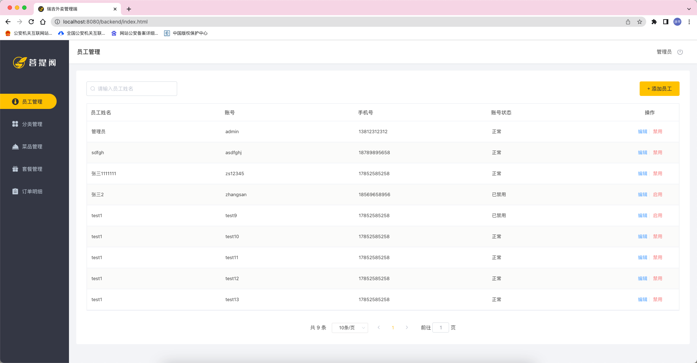
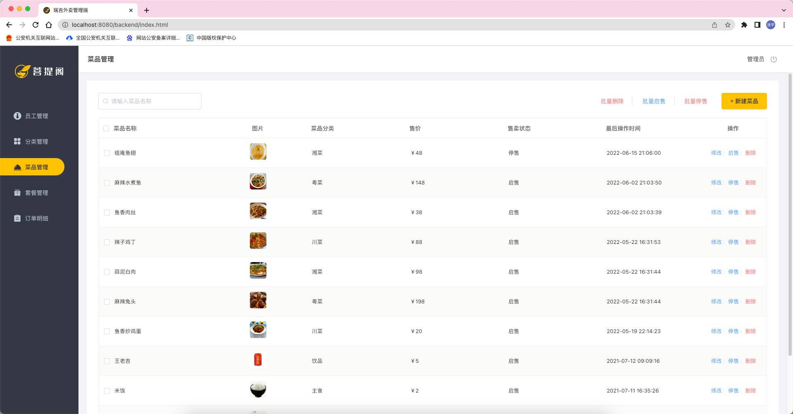
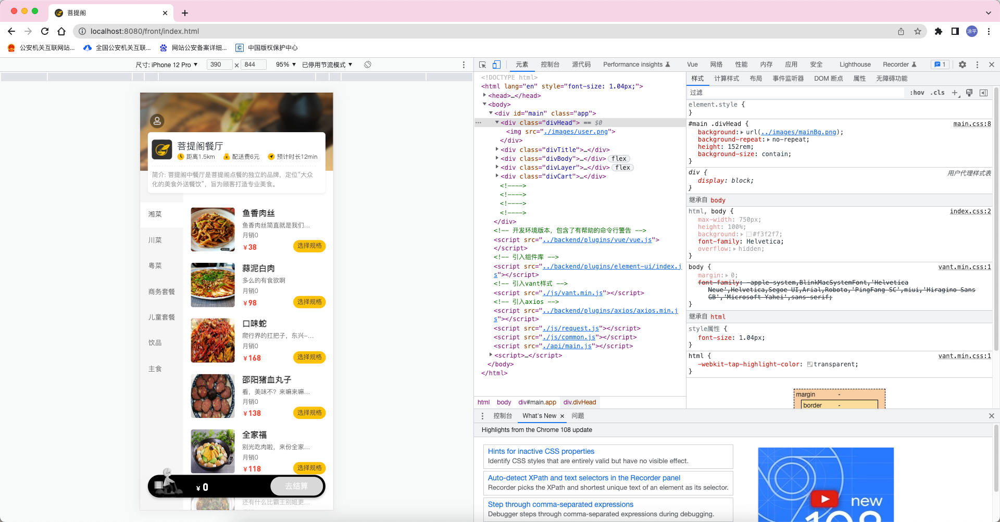

### 一. 项目介绍

本项目(瑞吉外卖)是专门为餐饮企业(餐厅、饭店)定制的一款软件产品，包括系统管理后台和移动端应用两部分。其中系统管理后台主要提供给餐饮企业内部员工使用，可以对餐厅的菜品、套餐、订单等进行管理维护。移动端应用主要提供给消费者使用，可以在线浏览菜品、添加购物车、下单等。

本项目共分为3期进行开发：

- 第一期主要实现基本需求，其中移动端应用通过H5实现，用户可以通过手机浏览器访问。
- 第二期主要针对移动端应用进行改进，使用微信小程序实现，用户使用起来更加方便。
- 第三期主要针对系统进行优化升级，提高系统的访问性能。

### 二. 产品原型
项目成型前的一个简单的布局框架结构图，对于初步的需求有一个可视化的展示。

通过原型展示可以更直观了解项目中的需求，当然产品原型只是一个初步的结构，并不代表最终效果。

### 三. 技术架构

项目属于前后端分离，前端使用H5页面构建页面。

后端技术：springboot + mybatisPlus + redis + nginx

代码管理工具使用的是Git仓库。

### 四. 功能描述

移动端前台主要是使用H5页面以及微信小程序搭建前端页面，主要功能有：

- 手机号登录
- 历史订单查看
- 菜品规格展示
- 添加，清空购物车
- 用户下单
- 菜品浏览
- 用户地址管理

**系统后台主要实现功能：**
- 分类管理
- 菜品管理
- 套餐管理
- 菜品口味管理
- 员工管理
- 订单管理

### 附录：项目成果图展示

**后端管理页面：**

登录页面：[http://localhost:8080/backend/page/login/login.html](http://localhost:8080/backend/page/login/login.html)

菜品管理页面：

APP端管理页面: [http://localhost:8080/front/index.html](http://localhost:8080/front/index.html)

菜品展示页：

